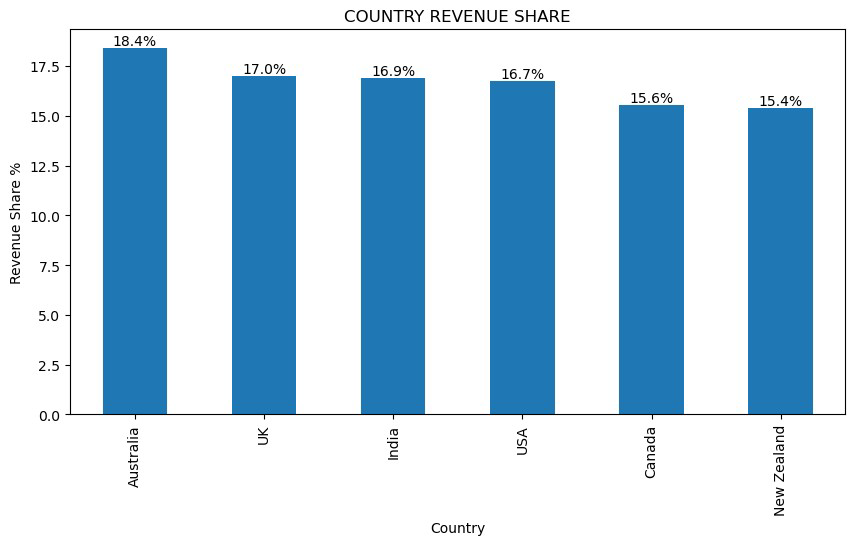
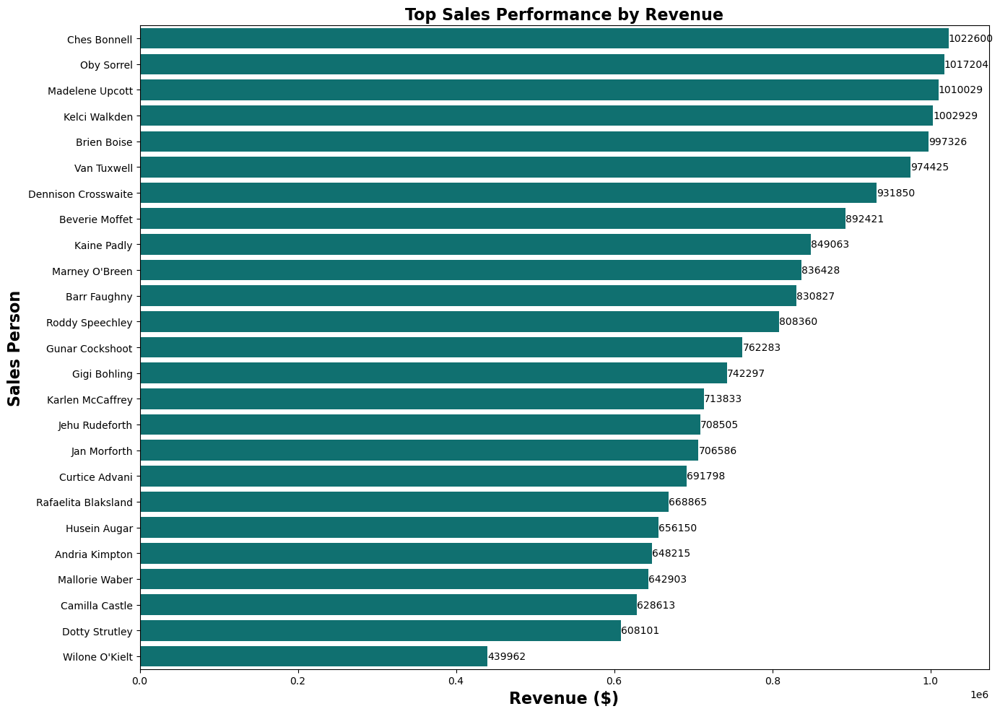
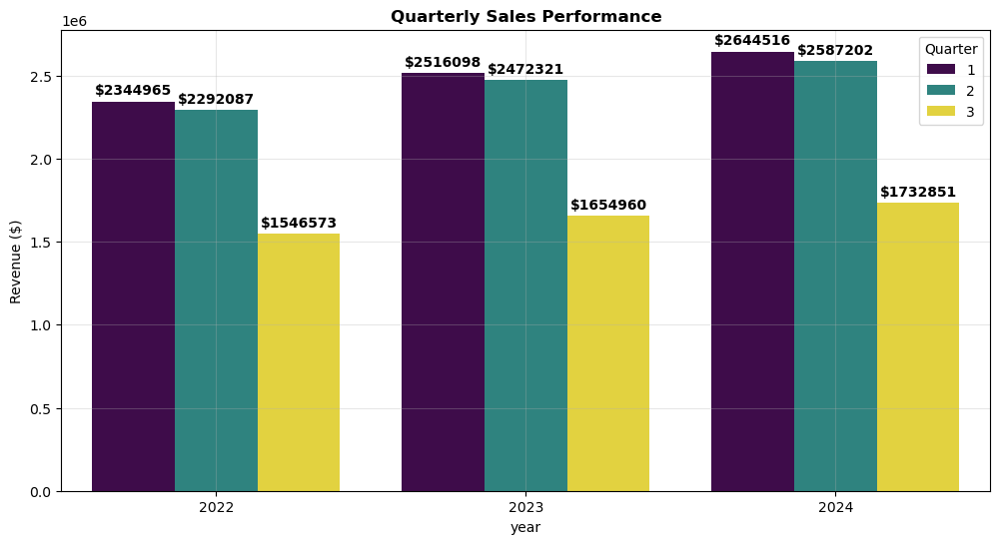

# 🍫 Chocolate Sales Data Analysis

### An end-to-end data analytics project uncovering actionable insights from global chocolate sales


> *"Data doesn’t lie — it just needs someone to listen. Every sale, seasonality trend, and product performance tells a story."*

---

## 📌 Table of Contents

- [Project Overview](#-project-overview)
- [Dataset](#-dataset)
- [Key Findings](#-key-findings)
- [Visualizations](#-visualizations)
- [KPI Dashboard](#-kpi-dashboard)
- [Methodology](#-methodology)
- [Tech Stack](#-tech-stack)
- [Project Structure](#-project-structure)
- [How to Run](#-how-to-run)
- [Strategic Takeaway](#-strategic-takeaway)

---

## 🔍 Project Overview

This project delivers a comprehensive **exploratory data analysis (EDA)** on a global chocolate sales dataset (3,282 transactions), uncovering patterns in revenue, seasonality, product mix, and sales rep performance.  

The analysis includes:

- ✅ Data cleaning & preprocessing  
- ✅ Month-over-month & year-over-year growth analysis  
- ✅ Seasonal pattern detection  
- ✅ Product mix and sales performance trends  
- ✅ Sales rep ranking  
- ✅ Country revenue comparison  

---

## 📂 Dataset

| Property | Detail |
|---|---|
| **Source** | Global Chocolate Sales Dataset (`chocolate_sales.csv`) |
| **Transactions** | 3,282 |
| **Countries** | 6 |
| **Products** | 22 |
| **Sales Reps** | 25 |
| **Boxes Shipped** | 540,437 |
| **Total Revenue** | $19.79M |

---

## 💡 Key Findings

### 01 — Growth is Slowing 📉
Revenue growth declined from +7.4% in 2023 → +4.8% in 2024. Plateau expected by 2026 if trends continue.

### 02 — Seasonality is Predictable 📅
- January: Peak (+29% MoM)  
- August: Lowest (-8% MoM)  
Pattern repeated across all three years.

### 03 — Market Insights 🌏
Australia leads at $3.65M (18.4%), but all markets are balanced — low over-reliance risk.

### 04 — Sales Rep Performance Gap 💼
Top rep generates $1.02M vs $440K for the lowest → 132% performance gap within the team.

### 05 — Product Mix 🍫
Top 5 products account for only 26.8% of revenue → diversified portfolio reduces business risk.

### 06 — Biggest Opportunities 💡
1️⃣ Launch summer campaigns in July-August → fix the Q3 dip  
2️⃣ Coach bottom-performing reps → +$700K potential  
3️⃣ Re-price low Rev/Box products like Caramel Stuffed Bars  
4️⃣ Expand in Canada & New Zealand — most underperforming markets  

---

## 📊 Visualizations

### Revenue Trend


### Top Sales Reps Performance


### Product Mix Over Time


---

## 📈 KPI Dashboard

### 💰 Revenue KPIs

| KPI | Value |
|---|---|
| Total Revenue | $19.79M |
| YoY Growth 2023 → 2024 | +4.8% |
| Monthly Avg Revenue | $675K |
| Boxes Shipped | 540,437 |

### 👨‍💼 Sales Rep KPIs

| KPI | Value |
|---|---|
| Top Rep Revenue | $1.02M |
| Bottom Rep Revenue | $440K |
| Rep Performance Gap | 132% |

### 🍫 Product KPIs

| KPI | Value |
|---|---|
| Top 5 Product Revenue Share | 26.8% |
| Diversified Portfolio | ✅ |

---
```
## 🔬 Methodology

Raw Data (3,282 rows × 22 cols)
│
▼
Data Cleaning
├── Remove duplicates
├── Handle missing values
└── Correct inconsistent data
│
▼
Exploratory Data Analysis
├── Revenue trends (MoM & YoY)
├── Seasonal pattern detection
├── Product performance analysis
├── Country revenue comparison
└── Sales rep ranking
│
▼
KPI Development & Insights
├── Top/Bottom performers
├── Product mix evaluation
└── Market opportunity identification
│
▼
Recommendations
├── Campaign timing optimization
├── Product repricing strategies
├── Sales rep coaching
└── Market expansion plans
```
## 🛠 Tech Stack

| Library | Purpose |
|---|---|
| `pandas` | Data manipulation & analysis |
| `numpy` | Numerical computations |
| `matplotlib` | Static visualizations |
| `seaborn` | Statistical visualizations |
| `plotly` | Interactive visualizations |
| `jupyter` | Notebook environment |

---
```
Chocolate_Sales-Data-Analysis/
│
├── 📓notebooks/
│ └── Chocolate_Sales_EDA.ipynb
├── data/
│ └── 📊chocolate_sales.csv
├── visuals/
│ ├── revenue_trend.png
│ ├── top_reps.png
│ └── product_mix.png
└── 📄 README.md
```
## ▶️ How to Run

**1. Clone the repository**
```bash
git clone https://github.com/mohmedmarof2551997-sudo/majorel-hr-analysis.git
cd majorel-hr-analysis
```

**2. Install dependencies**
```bash
pip install pandas numpy matplotlib seaborn plotly jupyter
```

**3. Launch the notebook**
```bash
jupyter notebook Chocolate_Sales Data Analysis.ipynb
```
📌 Strategic Takeaway

Revenue, seasonality, product performance, and sales rep efficiency are measurable signals. By identifying dips, top performers, and product gaps, businesses can optimize campaigns, repricing strategies, and market expansion plans — turning data into actionable growth.

---

*Built with Python & Jupyter Notebook — if you found this project useful, please consider giving it a ⭐*

